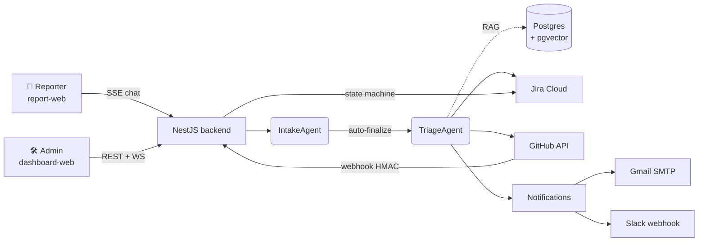

# 🤖 SRE Incident Response Agent

> **AgentX Hackathon 2026** — An autonomous multi-agent system that turns free-form incident reports from non-technical users into fully-triaged Jira tickets, GitHub branches, and team notifications — end to end, in under a minute.

[](https://nestjs.com)
[](https://react.dev)
[](https://prisma.io)
[](https://github.com/pgvector/pgvector)
[](#-ai-agents)

---

## 📚 Documentation map

| Document | What's inside |
|---|---|
| **[QUICKGUIDE.md](QUICKGUIDE.md)** | One-command setup, `.env` walkthrough, verification, pre-built test scenario |
| **[AGENTS_USE.md](AGENTS_USE.md)** | Deep dive on every agent, orchestration, context engineering, security, observability |
| **[HANDOFF.md](HANDOFF.md)** | Full technical handoff — module map, IoC bridges, design patterns, integration setup |
| **🎥 Demo video** | _TBD — link added before submission_ |

---

## 🎯 What it does

A non-technical user (e.g. a support agent for the reference e-commerce **Reaction Commerce**) opens a minimal chat UI, describes a problem in plain language, and optionally attaches screenshots. Within seconds the system:

1. **Chats** with the reporter through the `IntakeAgent` until it has enough context (never asks for titles, priorities, or technical metadata).
2. **Auto-finalizes** the conversation, embeds it, and runs a **pgvector similarity search** to find related past incidents.
3. **Triages** the incident with the `TriageAgent` (Gemini 2.5 Pro) — producing title, description, priority, service and summary grounded on RAG context.
4. **Creates a Jira ticket** in the configured project (language-agnostic — works in English, Spanish, or any language).
5. **Creates a GitHub branch** from `main` so engineers can start working immediately.
6. **Notifies the team** via Email (Gmail SMTP) and Slack with a rich, branded payload.
7. **Reacts to GitHub events** (push, PR opened, PR merged…) through a signed webhook and moves both the internal incident and the Jira ticket through a configurable **GitOps state machine**.
8. On `DONE`, the `EmailComposerAgent` drafts and sends a personalized resolution notification back to the original reporter.

---

## ✅ Hackathon deliverables checklist

| Requirement | Status | Evidence |
|---|---|---|
| Incident submission UI | ✅ | [`apps/report-web/src/pages/ChatPage.tsx`](apps/report-web/src/pages/ChatPage.tsx) |
| LLM-powered triage | ✅ | [`apps/backend/src/incidents/agents/sre.agent.ts`](apps/backend/src/incidents/agents/sre.agent.ts) |
| Automatic ticket creation (Jira) | ✅ | [`apps/backend/src/integrations/jira/jira.service.ts`](apps/backend/src/integrations/jira/jira.service.ts) |
| Team notification (Email + Slack) | ✅ | [`apps/backend/src/notifications/observers/`](apps/backend/src/notifications/observers/) |
| Resolution notification | ✅ | [`email.observer.ts`](apps/backend/src/notifications/observers/email.observer.ts) |
| `README.md` | ✅ | this file |
| `QUICKGUIDE.md` | ✅ | [QUICKGUIDE.md](QUICKGUIDE.md) |
| `AGENTS_USE.md` | ✅ | [AGENTS_USE.md](AGENTS_USE.md) |
| `docker-compose.yml` at root | ✅ | [docker-compose.yml](docker-compose.yml) |
| `.env.example` at root | ✅ | [.env.example](.env.example) |
| Demo video (≤10 min) | ⏳ | _to attach_ |

---

## 🧠 AI agents

> **Architecture note.** Every reasoning agent in the system uses a **runtime-configurable LLM**: providers, models, and per-agent assignments live in the `llm_providers`, `llm_models` and `llm_configs` Postgres tables and are edited from **Admin → LLM** in the dashboard. The Strategy pattern in [`packages/llm-client/`](packages/llm-client/) lets us swap Gemini ↔ OpenAI ↔ Anthropic Claude at runtime with **zero restart**.
>
> **Current submission setup** — all reasoning agents are pointed at **Google Gemini 2.5 Pro** for the hackathon demo. Embeddings stay on **OpenAI `text-embedding-3-small`** because Gemini's embedding model is not 1536-dim compatible with our pgvector schema.

| Agent | Type | Configured model (today) | Responsibility | Source |
|---|---|---|---|---|
| **IntakeAgent** | Reasoning (configurable) | **Gemini 2.5 Pro** | Natural conversation with reporter, auto-finalizes when context is enough | [`intake.agent.ts`](apps/backend/src/chat/agents/intake.agent.ts) |
| **TriageAgent (SREAgent)** | Reasoning (configurable) | **Gemini 2.5 Pro** | RAG-grounded triage → structured incident DTO | [`sre.agent.ts`](apps/backend/src/incidents/agents/sre.agent.ts) |
| **EmailComposerAgent** | Reasoning (configurable) | **Gemini 2.5 Pro** | Writes the resolution email to the reporter | [`email.observer.ts`](apps/backend/src/notifications/observers/email.observer.ts) |
| **Embeddings** | Vectorizer (fixed) | **OpenAI `text-embedding-3-small`** (1536-dim) | Vectorizes incidents + repo files for pgvector similarity search | [`rag.service.ts`](apps/backend/src/rag/rag.service.ts) |

To switch any reasoning agent to a different provider/model, no code change is needed: open **Admin → LLM**, edit the assignment row for that agent role, and the next call will use the new model. Configuration tables: `llm_providers`, `llm_models`, `llm_configs` (see [Prisma schema](apps/backend/prisma/schema.prisma)).

---

## 🏗️ Architecture



**Key modules** (all inside [`apps/backend/src/`](apps/backend/src/)):

- [`auth/`](apps/backend/src/auth/) — JWT RS256 + refresh rotation + RBAC guard
- [`chat/`](apps/backend/src/chat/) — SSE streaming + IntakeAgent + auto-finalize pipeline
- [`incidents/`](apps/backend/src/incidents/) — full triage pipeline + similarity detection
- [`rag/`](apps/backend/src/rag/) — pgvector similarity + repo indexer
- [`integrations/jira/`](apps/backend/src/integrations/jira/) — language-agnostic Jira client (matches by `statusCategory.key`)
- [`integrations/github/`](apps/backend/src/integrations/github/) — branch creation + idempotent webhook installation
- [`branch-rules/`](apps/backend/src/branch-rules/) — GitOps state machine (drag-and-drop ordered rules)
- [`webhooks/`](apps/backend/src/webhooks/) — HMAC-verified GitHub webhook handler
- [`notifications/`](apps/backend/src/notifications/) — Observer-pattern notifiers (Email, Slack)
- [`llm/`](apps/backend/src/llm/) — runtime LLM provider/model/assignment CRUD

---

## 🧱 Tech stack

**Backend** — NestJS 10 · Prisma 5 · PostgreSQL (Supabase) · pgvector · Socket.io · nodemailer · JWT RS256
**Frontends** — React 18 · Vite 6 · TypeScript · TailwindCSS · framer-motion · @tanstack/react-query · zustand · @dnd-kit · socket.io-client
**AI** — Gemini 2.5 Pro (current) · OpenAI `text-embedding-3-small` (embeddings) · runtime-swappable to OpenAI / Anthropic Claude
**Integrations** — Jira Cloud REST v3 · GitHub REST v3 + Webhooks · Gmail SMTP · Slack incoming webhook
**DevOps** — Docker Compose · VS Code Dev Tunnels · `npm run init` one-shot bootstrap

---

## 🚀 Quick start

```bash
git clone <repo-url> && cd agentx-hackaton
cp .env.example .env          # fill in keys — see QUICKGUIDE.md
npm run init                   # installs, migrates, seeds Jira + GitHub, indexes repo
npm run dev:backend            # :3000
npm run dev:dashboard          # :5173
npm run dev:report             # :5174
```

➡️ Full setup + test scenario: **[QUICKGUIDE.md](QUICKGUIDE.md)**

---

## 🔐 Security highlights

- **HMAC-verified webhooks** — [`webhook-hmac.guard.ts`](apps/backend/src/webhooks/guards/webhook-hmac.guard.ts) rejects unsigned GitHub events
- **RBAC with granular permissions** — [`auth/decorators/`](apps/backend/src/auth/decorators/)
- **Protected super-admin** — DB-enforced `isProtected` flag
- **Swagger UI behind login** — [`swagger-auth.middleware.ts`](apps/backend/src/swagger/swagger-auth.middleware.ts)
- **Global input validation** — `ValidationPipe({ whitelist: true, forbidNonWhitelisted: true })`
- **Prompt injection defense** — untrusted user text wrapped in `<<<USER_DATA_START/END>>>` delimiters, system prompts explicitly instruct the model to treat that block as data, JSON-only responses with strict schema validation, enum-bounded priority field
- **Rate limiting** — global `ThrottlerGuard` (60 req/min/IP) wired in [`app.module.ts`](apps/backend/src/app.module.ts)
- **Secrets hygiene** — `.env` git-ignored, JWT RS256 keypair generated by `npm run init`
- **GCP credentials** — a testing-only service account (Storage Object Creator/Viewer) is included for hackathon judges at `apps/backend/.keys/gcp-credentials.json`. It will be **revoked after the event**. Judges can use their own GCP account by updating the env vars (see [`.env.example`](.env.example))

---

## 👤 Author

**Manuel Garcia** — AgentX Hackathon 2026

## 📄 License

[MIT](LICENSE)
